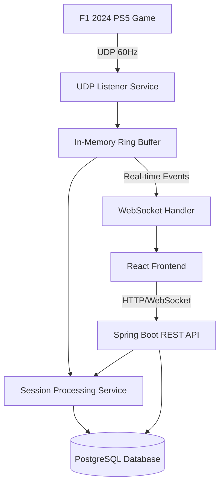

# F1_2024_telemetry_analyzer

The F1 2024 PS5 Telemetry Visualizer is a real-time data analysis application that captures, processes, and visualizes telemetry data from the F1 2024 PlayStation 5 game. The system receives UDP telemetry streams at 60Hz, processes the data in near real-time, persists session data to a database, and provides interactive visualizations through a web interface. The application enables F1 players to analyze their racing performance through comprehensive data insights and exportable reports.

The architecture follows a microservices pattern with clear separation of concerns: UDP data ingestion, real-time processing, persistence, and web presentation layers.

## Architecture

### High-Level Architecture

### Component Architecture

The system is organized into the following main components:

1. **UDP Telemetry Ingestion Layer**
   - UDP Listener Service
   - Packet Parser and Validator
   - Ring Buffer Manager

2. **Data Processing Layer**
   - Session Management Service
   - Real-time Event Processor
   - Data Transformation Service

3. **Persistence Layer**
   - PostgreSQL Database
   - Repository Pattern Implementation
   - Transaction Management

4. **API Layer**
   - REST Controllers
   - WebSocket Handlers
   - Data Export Services

5. **Frontend Layer**
   - React Application
   - Real-time Chart Components
   - Session Management UI
